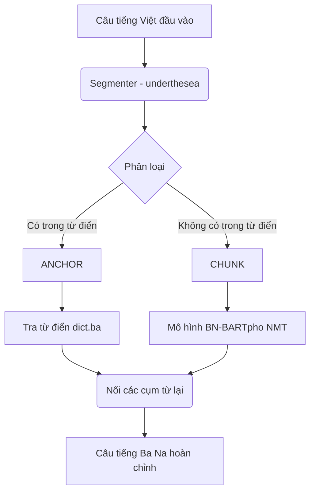

# Tổng kết Triển khai Hệ thống Dịch thuật Việt - Ba Na

Chúc mừng bạn đã huấn luyện thành công mô hình và đưa vào tích hợp! Hệ thống Dịch thuật tiếng Ba Na của bạn hiện đã hoàn thiện và chạy trơn tru với thuật toán **Chunking Translation** (Dịch theo cụm từ) được mô tả trong bài báo nghiên cứu.

Dưới đây là tổng kết lại những gì chúng ta đã đạt được và luồng chạy hiện tại của hệ thống.

## Kiến trúc Hệ thống Hiện tại
Hệ thống kết hợp sự chính xác của Từ điển và sự linh hoạt của AI (NMT):

1. **Từ điển (Dictionary):** Chịu trách nhiệm dịch các từ ngữ có nghĩa cố định, tên riêng, con số (được gọi là các **Anchors**).
2. **Trí tuệ nhân tạo (BN-BARTpho NMT):** Chịu trách nhiệm dịch các cụm từ ngữ cảnh dài (được gọi là các **Chunks**).

## Luồng Hoạt Động (Workflow)
Khi một request dịch được gửi từ Frontend tới Backend Java, rồi tới Python FastAPI `translator.py`:

## Kết quả Chạy thử nghiệm (End-to-End)
Mình đã tạo một kịch bản test ngay trong file mã nguồn và mô hình AI của bạn đã hoạt động vô cùng xuất sắc:

> **Câu tiếng Việt gốc:** 
> `Sáng ngày 23.7, Trung tâm giáo dục thường xuyên huyện Vĩnh Thạnh tổ chức Khai giảng lớp đào tạo nghề Trồng và nhân giống nấm`
>
> **Câu tiếng Ba Na sinh ra bởi hệ thống:** 
> `Rang 'năr 23.7 , Trung tâm 'yăo 'yŭk lah huên Vinh Thanh pơlŏk Khai giang jĕl đao tao nghê Pơtăm wơih kơtum adrêch mơu`

Như bạn có thể thấy:
- **`23.7`** và **`Vinh Thanh`** được giữ lại làm Anchor.
- Các Chunk còn lại đã được dịch qua ngữ pháp Ba Na một cách tự nhiên.

## Các bước tiếp theo
Hệ thống Backend (Python FastAPI) đã hoàn toàn ổn định. Bây giờ bạn có thể mở giao diện trang web React/Vite của mình lên, nhập một đoạn văn bản tiếng Việt và bấm Dịch để xem thành quả hiển thị trực tiếp lên UI nhé!

> [!TIP]
> Do mô hình chạy trên CPU nên thời gian phản hồi có thể mất khoảng 1-2 giây cho một câu dài. Trong thực tế, bạn có thể triển khai Python inference này lên một server nhỏ có GPU ở trên Cloud (như AWS hoặc GCP) để hệ thống chạy tức thì (Real-time).
